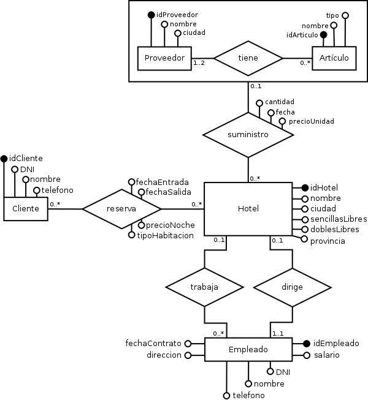

# Diseño conceptual y lógico de la base de datos
## Diagrama entidad-relación
El diagrama de entidad-relación resultante del análisis del enunciado es el siguiente:

### Alternativas
**Modelar director como una entidad hija de empleado**

No se necesitaba el potencial de modelar como otra entidad diferente, por otra parte hubiera complicado el diagrama.

**Provincia como entidad**

Se pensó hacerlo como entidad porque se tenía un grupo fijo de provincias, que aparecían por todo el diagrama, pero realmente solo se usarían las provincias a la hora de fragmentar, así que por simpleza se decidió modelarlas como atributo.

**Habitación como entidad débil de hotel**

No se necesitaba el potencial que da una entidad en este caso, así que para simplificarlo todo se decidió dejarlo como atributo.

**Agregación**

En vez de haber hecho uso de una agregación para relacionar el **Proveedor**, **Artículo** y **Suministro**, se podría haber optado por una relación *ternaria*. Pero las relaciones ternarias, pueden llegar a ser difíciles de entender. Además se llegó a la conclusión de que la agregación optimizaba el problema planteado.
### Paso a tablas
Las tablas resultantes del diagrama anterior son las siguientes:

* **Cliente** (_idCliente_, DNI, nombre, telefono)
* **Empleado** (_idEmpleado_, salario, DNI, nombre, telefono, direccion, fechaContrato)
* **Hotel** (_idHotel_, nombre, provincia, ciudad, sencillasLibres, doblesLibres)
* **Proveedor** (_idProveedor_, nombre, provincia)
* **Articulo** (_idArticulo_, nombre, tipo)
* **Reserva** (_idCliente, fechaEntrada, fechaSalida_, idHotel, precioNoche, tipoHabitacion )
* **Dirige** (_idEmpleado_, idHotel)
* **Trabaja** (_idEmpleado_, idHotel)
* **Tiene** (_idProveedor, idArticulo_)
* **Suministro** (_idHotel, fecha, idProveedor, idArticulo_, cantidad, precioUnidad)

### Alternativas
Con respecto a la propagación de llaves de tablas, se consideraron dos escenarios:

* El primero consistía en unir las tablas **Trabaja** y **Empleado** por un lado y **Dirige** y **Hotel** por otro.
* El segundo consistía únicamente en unir sólo una de las dos parejas anteriores.

La implementación de la primera de las opciones conllevaba bucles de referencias que no podían ser solucionados, así que finalmente se optó por la unión de sólo una de las dos parejas de tablas antes referidas. Tras propagar las llaves de **Dirige** en la tabla **Hotel**, el conjunto de tablas resultantes es el siguiente:

* **Cliente** (_idCliente_, DNI, nombre, telefono)
* **Empleado** (_idEmpleado_, salario, DNI, nombre, telefono, direccion, fechaContrato)
* **Hotel** (_idHotel_, nombre, provincia, sencillasLibres, doblesLibes, idDirector)
* **Proveedor** (_idProveedor_, nombre, provincia)
* **Articulo** (_idArticulo_, nombre, tipo)
* **Reserva** (_idCliente, fechaEntrada, fechaSalida_, idHotel, precioNoche, tipoHabitacion, )
* **Trabaja** (_idEmpleado_, idHotel)
* **Tiene** (_idProveedor, idArticulo_)
* **Suministro** (_idHotel, fecha, idProveedor, idArticulo_, cantidad, precioUnidad)

## Diseño de la fragmentación y de la asignación
### Introducción
La base de datos distribuida tendrá sus datos físicos almacenados en cuatro localidades: **Granada, Cádiz, Sevilla y Málaga**.

Cada una de estas localidades almacenará la información de los siguientes lugares:

1. **Granada** = Granada y Jaén
2. **Cádiz** = Cádiz y Huelva
3. **Sevilla** = Sevilla y Córdoba
4. **Málaga** = Málaga y Almería

Ahora, basándose en el diagrama *Entidad Relación* realizado anteriormente y estos datos, se hace la fragmentación.

### Fragmentación
#### Tablas a fragmentar.
La fragmentación se realizará en dos pasos:

1. Fragmentaciones horizontales primarias de aquellas tablas cuyas tuplas tengan una relación directa con la localidad en la que se encuentran.
2. Fragmentaciones horizontales, derivadas de las anteriores, de aquellas tablas que tengan una relación directa con los fragmentos. Tendremos en consideración el *grado de relación* de las tuplas con la localidad, de manera que en cada caso se decidirá entre **fragmentación** o **replicación**.

#### Fragmentaciones horizontales primarias
Las dos únicas tablas cuyas tuplas tienen una relación directa -mediante un atributo de las mismas- de la localidad en la que se encuentran son **Hotel** y **Proveedor**.

Es claro entonces que la fragmentación hay que realizarla en base al atributo *provincia* de las mismas. Esta decisión tiene como principal objetivo maximizar los accesos locales: los accesos que involucren a las tablas **Hotel** y **Proveedor** se realizarán, en su mayoría, desde las ciudades cuyas tuplas se necesita consultar.

#### Hotel

Predicados simples:

    P = { Provincia = Granada, Provincia = Jaén, Provincia = Cádiz,
      Provincia = Huelva, Provincia = Sevilla, Provincia = Córdoba,
      Provincia = Málaga, Provincia = Almería } }

Para facilitarnos la tarea, notemos cada predicado.

1. Pgra = Provincia = Granada
2. Pjae = Provincia = Jaén
3. Pcad = Provincia = Cádiz
4. Phue = Provincia = Huelva
5. Psev = Provincia = Sevilla
6. Pcor = Provincia = Córdoba
7. Pmal = Provincia = Málaga
8. Palm = Provincia = Añmería

Los predicados verdaderos:

1. y1 =   Pgra ^ ¬Pjae ^ ¬Pcad ^ ¬Phue ^ ¬Psev ^ ¬Pcor ^ ¬Pmal ^ ¬Palm
2. y2 =  ¬Pgra ^  Pjae ^ ¬Pcad ^ ¬Phue ^ ¬Psev ^ ¬Pcor ^ ¬Pmal ^ ¬Palm
3. y3 =  ¬Pgra ^ ¬Pjae ^  Pcad ^ ¬Phue ^ ¬Psev ^ ¬Pcor ^ ¬Pmal ^ ¬Palm
4. y4 =  ¬Pgra ^ ¬Pjae ^ ¬Pcad ^  Phue ^ ¬Psev ^ ¬Pcor ^ ¬Pmal ^ ¬Palm
5. y5 =  ¬Pgra ^ ¬Pjae ^ ¬Pcad ^ ¬Phue ^  Psev ^ ¬Pcor ^ ¬Pmal ^ ¬Palm
6. y6 =  ¬Pgra ^ ¬Pjae ^ ¬Pcad ^ ¬Phue ^ ¬Psev ^  Pcor ^ ¬Pmal ^ ¬Palm
7. y7 =  ¬Pgra ^ ¬Pjae ^ ¬Pcad ^ ¬Phue ^ ¬Psev ^ ¬Pcor ^  Pmal ^ ¬Palm
8. y8 =  ¬Pgra ^ ¬Pjae ^ ¬Pcad ^ ¬Phue ^ ¬Psev ^ ¬Pcor ^ ¬Pmal ^  Palm

Entonces nos da como resultado 8 fragmentos:

1. Hotel1 = SL1(Hotel)
2. Hotel2 = SL2(Hotel)
3. Hotel3 = SL3(Hotel)
4. Hotel4 = SL4(Hotel)
5. Hotel5 = SL5(Hotel)
6. Hotel6 = SL6(Hotel)
7. Hotel7 = SL7(Hotel)
8. Hotel8 = SL8(Hotel)

Entonces se hace la asignación de tal forma que se adapte a la representación física que se proporciona

1. Granada: Hotel1,Hotel2
2. Cádiz: Hotel3,Hotel4
3. Sevilla: Hotel5,Hotel6
4. Málaga: Hotel7,Hotel8

#### Proveedor

Los proveedores de la cadena están todos en *Granada* y en *Sevilla*, de manera que su área de acción es la siguiente:

Proveedores en *Granada*: Suministran a Granada, Jaén, Málaga y Almería.

Proveedores en *Sevilla*: Suministran a Sevilla, Córdoba, Cádiz y Huelva.

Predicados simples:

    P = { Provincia = Granada, Provincia = Sevilla }

Para facilitarnos la tarea, notemos cada predicado.

1. Pgra = Provincia = Granada
2. Psev = Provincia = Sevilla

Los predicados verdaderos:

1. y1 =   Pgra ^ ¬Psev
2. y2 =  ¬Pgra ^ Psev

Resultan entonces 2 fragmentos:

1. Proveedor1 = SL1(Proveedor)
2. Proveedor2 = SL2(Proveedor)

La asignación de los fragmentos se hace de tal forma que se adapte a la representación física que se proporciona:

1. Granada: Proveedor1
2. Sevilla: Proveedor2

#### Fragmentaciones horizontales derivadas

Derivadas de las fragmentaciones anteriormente realizadas, a continuación se presentan las fragmentaciones de tablas que, si bien no tienen un atributo *provincia* explícito, tienen una relación indirecta con la provincia en la que se encuentran. Estas tablas son:

* Empleado
* Tabla
* Reserva
* Suministro
* Tiene

El objetivo de estas fragmentaciones horizontales derivadas es, igual que en las anteriores, maximizar los accesos locales; es lícito suponer que los accesos que involucren a estas tablas en sus consultas se realizarán en su gran mayoría desde las localidades donde se encuentren físicamente sus tuplas.

##### Trabaja
Se hace a partir del Hotel.

Resultan 8 fragmentos:

1. Trabaja1 = Trabaja SJNCodH=CodH Hotel1
2. Trabaja2 = Trabaja SJNCodH=CodH Hotel2
3. Trabaja3 = Trabaja SJNCodH=CodH Hotel3
4. Trabaja4 = Trabaja SJNCodH=CodH Hotel4
5. Trabaja5 = Trabaja SJNCodH=CodH Hotel5
6. Trabaja6 = Trabaja SJNCodH=CodH Hotel6
7. Trabaja7 = Trabaja SJNCodH=CodH Hotel7
8. Trabaja8 = Trabaja SJNCodH=CodH Hotel8

La asignación se hace de la siguiente forma:

1. Granada: Trabaja1, Trabaja2
2. Cádiz: Trabaja3, Trabaja4
3. Sevilla: Trabaja5, Trabaja6
4. Málaga: Trabaja7, Trabaja8

##### Empleado
Se hace a partir de la tabla Trabaja.

Resultan 8 fragmentos:

1. Empleado1 = Empleado SJNCodH=CodH Trabaja1
2. Empleado2 = Empleado SJNCodH=CodH Trabaja2
3. Empleado3 = Empleado SJNCodH=CodH Trabaja3
4. Empleado4 = Empleado SJNCodH=CodH Trabaja4
5. Empleado5 = Empleado SJNCodH=CodH Trabaja5
6. Empleado6 = Empleado SJNCodH=CodH Trabaja6
7. Empleado7 = Empleado SJNCodH=CodH Trabaja7
8. Empleado8 = Empleado SJNCodH=CodH Trabaja8

La asignación se hace de la siguiente forma:

1. Granada: Empleado1, Empleado2
2. Cádiz: Empleado3, Empleado4
3. Sevilla: Empleado5, Empleado6
4. Málaga: Empleado7, Empleado8

##### Reserva
Se hace a partir del Hotel.

Resultan 8 fragmentos:

1. Reserva1 = Reserva SJNCodH=CodH Hotel1
2. Reserva2 = Reserva SJNCodH=CodH Hotel2
3. Reserva3 = Reserva SJNCodH=CodH Hotel3
4. Reserva4 = Reserva SJNCodH=CodH Hotel4
5. Reserva5 = Reserva SJNCodH=CodH Hotel5
6. Reserva6 = Reserva SJNCodH=CodH Hotel6
7. Reserva7 = Reserva SJNCodH=CodH Hotel7
8. Reserva8 = Reserva SJNCodH=CodH Hotel8

La asignación se hace de la siguiente forma:

1. Granada: Reserva1, Reserva2
2. Cádiz: Reserva3, Reserva4
3. Sevilla: Reserva5, Reserva6
4. Málaga: Reserva7, Reserva8

##### Suministro
se hace a partir de Proveedor

Resultan 8 fragmentos:

1. Suministro1 = Suministro SJNCodH=CodH Proveedor1
2. Suministro2 = Suministro SJNCodH=CodH Proveedor2

La asignación se hace de la siguiente forma:

1. Granada: Suministro1
2. Sevilla: Suministro2

##### Tiene
se hace a partir de Proveedor.

Resultan 2 fragmentos:

1. Tiene1 = Tiene SJNCodH=CodH Proveedor1
2. Tiene2 = Tiene SJNCodH=CodH Proveedor2

La asignación se hace de la siguiente forma:

1. Granada: Tiene1
2. Sevilla: Tiene2

#### Replicaciones

Las dos tablas restantes, **Cliente** y **Artículo**, no tienen una relación directa ni indirecta con la provincia. Se podría entonces optar por la asignación de todas las tuplas a una sola localidad o por la réplica de los datos en todas ellas.

Se puede suponer que la cantidad de actualizaciones de estas dos tablas no es crítica, de manera que es mejor optimizar los accesos locales que las actualizaciones remotas. Por tanto, la réplica es la opción óptima.

##### Cliente
La replicamos en todos los puntos de almacenamiento. Se hace así ya que un cliente no está intrínsicamente relacionado con ninguna zona geográfica.

##### Artículo
La replicamos en los puntos de almacenamiento de los proveedores. Se hace así ya que los artículos no están intrínsicamente relacionados con ninguna zona geográfica, pero sólo serán usados por los proveedores.

#### Alternativas o Justificación
**Hotel**
Se decidió fragmentarlo en cuatro nodos atendiendo a la provincia para mejorar las operaciones locales.
**Dirige, Empleado, Reserva**
Se decidió usar fragmentación horizontal derivdad por **Hotel**, porque se ajustaba mejor al problema.
**Proveedor**
Se decidió fragmentarlo en los dos nodos que toma provincia para mejorar las operaciones locales.
**Tiene**
Se decidió usar fragmentación horizontal derivada por **Proveedor**, porque se ajustaba mejor al problema.
**Cliente**
Como fragmentamos **Reserva**, se planteó fragmentar **Cliente** también.Pero un cliente podía reservar en cualquier sitio, por lo que la replicación en toda la base de datos se ajustaba mejor al problema.
**Articulo**
Como fragmentamos **Tiene**, se planteó fragmentar **Artículo** también. Pero un artículo podía tener varios proveedores de distintas provincias. Así que decidimos replicarlo en dónde estában los proveedores.
**Suministra**
Se decidió fragmentarla en las localidades de **Proveedor**, ya que es más coherente y en la mayoría de los casos optimizaría mejor las consultas. Se pensó también en fragmentarla en las localidades de **Hotel** pero nos pareció que optimizaría menos.
